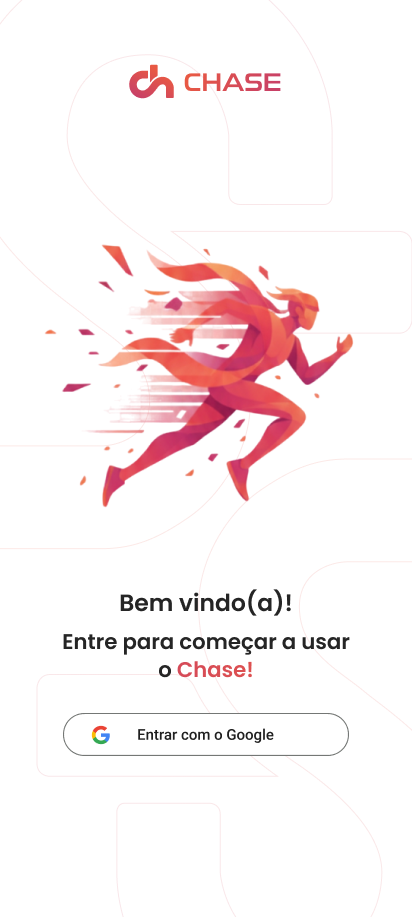
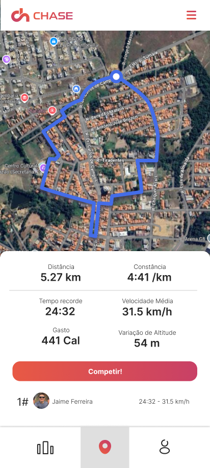
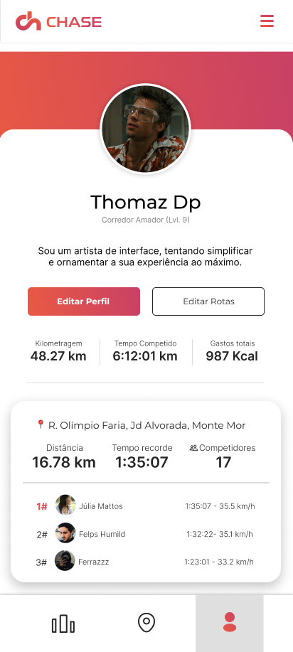
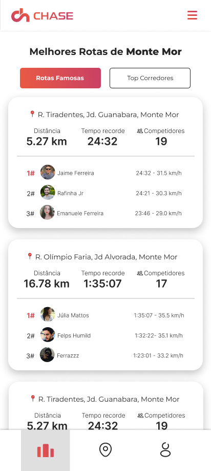

    

    <h1>Chase - Aplicativo de Corrida Gamificado</h1>

---

<h2 id="desc"> 📖 Descrição Geral</h2>

**Chase** é um aplicativo mobile que transforma a corrida numa experiência gamificada e social. Utilizadores podem criar rotas, competir por melhores tempos, conquistar territórios e interagir com uma comunidade de corredores. O objetivo é combater a monotonia e a falta de motivação, na prática de exercícios físicos, especialmente entre iniciantes e corredores ocasionais.

---

<h2 id="func"> 🚀 Funcionalidades</h2>

### 🗺️ Criação e Exploração de Rotas
- Crie rotas personalizadas usando GPS.
- Explore rotas criadas por outros utilizadores na sua cidade ou durante viagens.

### 🏆 Competição e Rankings
- Competir em rotas de outros utilizadores.
- Rankings por segmento com recordes pessoais (PR).
- Sistema de pontuação e badges por conquistas.

### 👥 Social e Comunidade
- Perfis de usuário com estatísticas e conquistas.
- Seguir amigos e comparar desempenho.
- Compartilhar rotas e resultados.

### 🎮 Gamificação
- Pontuação por completar rotas.
- Conquista de territórios virtuais.

### 📱 Experiência do Utilizador
- Interface moderna e intuitiva com Jetpack Compose.

---

<h2 id="arq"> 📐 Arquitetura do Projeto</h2>

Utilizamos uma arquitetura moderna e escalável, combinando tecnologias robustas para frontend, backend e armazenamento.

### 🔹 Mobile (Kotlin + Jetpack Compose) MVVM
- Desenvolvimento nativo Android com UI declarativa.
- Integração com GPS e mapas para rastreamento em tempo real.

### 🔹 Backend (Java + Spring Boot)
- API RESTful para gerenciamento de usuários, rotas e rankings.
- Comunicação segura entre app e servidor.

### 🔹 Banco de Dados (MongoDB)
- Armazenamento flexível de dados de rotas, utilizadores e histórico de corridas.

### 🔹 Serviços Externos
- **Google Maps SDK**: Visualização e criação de rotas.
- **Firebase**: Autenticação, notificações e analytics.

---

<h2 id="obs">📝 Diferenciais</h2>

- **Gamificação Imersiva**: Transforma ruas e parques em arenas de competição.
- **Comunidade Colaborativa**: Rotas criadas e validadas pelos utilizadores.
- **Progressão Visual**: Acompanhamento claro de evolução e conquistas.
- **Motivação Social**: Competição saudável com amigos e ranking local.

---

<h2 id="tech"> 🛠️ Tecnologias Utilizadas</h2>

| Categoria              | Tecnologia               | Descrição                           |
|------------------------|--------------------------|-------------------------------------|
| Mobile Frontend        | Kotlin + Jetpack Compose | UI moderna e reativa para Android.  |
| Backend                | Java + Spring Boot       | API robusta e escalável.            |
| Banco de Dados         | MongoDB                  | Armazenamento NoSQL flexível.       |
| Mapas e Geolocalização | Google Maps SDK          | Criação e exibição de rotas.        |
| Autenticação           | Firebase Auth            | Gerenciamento seguro de usuários.   |
| Controle de Versão     | Git                      | Versionamento de código.            |
| Design e Prototipagem  | Figma                    | Interface e experiência do usuário. |

---

---
<h2 id="database">🗃️ Modelos do Banco de Dados</h2>

O Chase utiliza MongoDB para armazenamento de dados. Abaixo estão as principais coleções e seus campos:

### 📊 Coleção: Users
Armazena informações dos usuários e suas estatísticas.

| Campo | Tipo | Descrição |
|-------|------|-----------|
| \_id | String | ID único do usuário |
| email | String | E-mail do usuário |
| displayName | String | Nome de exibição |
| photoUrl | String | URL da foto de perfil |
| createdAt | Date | Data de criação da conta |
| medals | Array | Lista de medalhas/conquistas |
| totalCalories | Number | Total de calorias queimadas |
| totalDistance | Number | Distância total percorrida |
| totalTime | Number | Tempo total de corrida |

### 🗺️ Coleção: Routes
Armazena as rotas criadas pelos usuários.

| Campo | Tipo | Descrição |
|-------|------|-----------|
| \_id | ObjectId | ID único da rota |
| criadorId | String | ID do criador da rota |
| nome | String | Nome da rota |
| pontos | Array | Coordenadas GPS da rota |
| distancia | Number | Distância total da rota |
| tempoRecorde | String | Melhor tempo na rota |
| velocidadeMediaRecorde | Number | Melhor velocidade média |
| caloriasEstimadas | Number | Calorias estimadas |
| visibilidade | String | Visibilidade da rota |
| dataCriacao | Date | Data de criação |
| ranking | Array | Ranking de melhores tempos |

### 🏃‍♂️ Coleção: Runs
Armazena o histórico de corridas dos usuários.

| Campo | Tipo | Descrição |
|-------|------|-----------|
| \_id | ObjectId | ID único da corrida |
| userId | String | ID do usuário |
| routeId | String | ID da rota utilizada |
| date | Date | Data e hora da corrida |
| totalTime | String | Tempo total da corrida |
| averageSpeed | Number | Velocidade média |
| caloriesBurned | Number | Calorias queimadas |

---

<h2 id="telas">💻 Telas do Sistema</h2>

[Acesse o design no Figma](https://www.figma.com/design/4Uc89tPYKJmkGYDoHKaI4c/CHASE?node-id=0-1&p=f&t=ym4cSAgGbIbEGTZz-0)

| Tela Inicial - Autenticação                | Detalhes da Rota                                                  | Perfil do Usuário                                            | Competição em Tempo Real                                   |
|--------------------------------------------|-------------------------------------------------------------------|--------------------------------------------------------------|------------------------------------------------------------|
| *Se autentique usando sua conta da Google* | *Informações detalhadas da rota, recordes e opção para competir.* | *Estatísticas, badges conquistados e histórico de corridas.* | *Interface durante a corrida com tracking GPS e métricas.* |
|          |                              |                              |                              |

---

<h2 id="colab">🤝 Colaboradores</h2>
Um agradecimento especial à equipe de desenvolvimento do Chase.

<table>
  <!-- Informações sobre a Eduarda -->
  <tr>
    <td align="center" width="150px">
      <a href="https://github.com/eduardanepomuceno" style="color: #ffffff; text-decoration: none;">
         
        
          <strong>Eduarda Nepomuceno</strong>
        
      </a>
    </td>
    <td>
      <h3>DESIGN E DESENVOLVIMENTO MOBILE</h3>
        

            Responsável pela interface do utilizador e experiência gamificada.
        

    </td>
  </tr>

  <!-- Informações sobre o Jean -->
  <tr>
    <td align="center" width="150px">
      <a href="https://github.com/jeanyuki148" style="color: #ffffff; text-decoration: none;">
         
        
          <strong>Jean Yuki</strong>
        
      </a>
    </td>
    <td>
      <h3>BACKEND E BANCO DE DADOS</h3>
        

            Desenvolvimento da API, integração com MongoDB e desenvolvimento das entidades do banco.
        

    </td>
  </tr>

  <!-- Informações sobre a Jhenifer -->
  <tr>
    <td align="center" width="150px">
      <a href="https://github.com/JheniferLais" style="color: #ffffff; text-decoration: none;">
         
        
          <strong>Jhenifer Laís</strong>
        
      </a>
    </td>
    <td>
      <h3>DESENVOLVIMENTO MOBILE, SERVIDOR E TESTES</h3>
        

            Implementação mobile, servidor java do maligno e testes unitários.
        

    </td>
  </tr>

  <!-- Informações sobre o João -->
  <tr>
    <td align="center" width="150px">
      <a href="https://github.com/joaogiatti" style="color: #ffffff; text-decoration: none;">
         
        
          <strong>João Giatti</strong>
        
      </a>
    </td>
    <td>
      <h3>BACKEND E DESIGN</h3>
        

            Desenvolvimento da API e desenvolvimento do prototipo(FIGMA)
        

    </td>
  </tr>

  <!-- Informações sobre o Thiago -->
  <tr>
    <td align="center" width="150px">
      <a href="https://github.com/thiagovolponi" style="color: #ffffff; text-decoration: none;">
         
        
          <strong>Thiago Volponi</strong>
        
      </a>
    </td>
    <td>
      <h3>TESTES E ANÁLISE DE DADOS</h3>
        

            Garantia de qualidade e análise de métricas de uso.
        

    </td>
  </tr>
</table>
